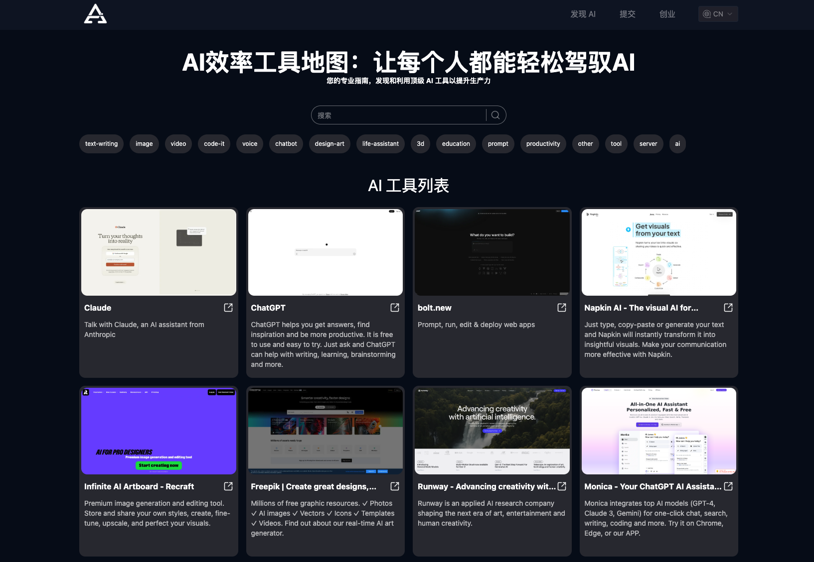

# 开源Tap4 AI Web UI

这是一个由[Tap4 AI工具导航站](https://tap4.ai)开源的AI导航站项目。我们的目标是让大家很容易就拥有一个属于自己的AI导航站，
收录自己喜欢的AI工具产品。这个项目非常轻量级，维护简单，适合对AI导航站感兴趣的个人开发者，也适合对NextJs有兴趣的学习者，
欢迎大家fork和star。

[English](https://github.com/6677-ai/tap4-ai-webui/blob/main/README.md) | 简体中文

Demo 🌍[AI Atlas](https://aiatlas.tech)

## v2.0.0版本更新说明

- AI站点数据采用supabase数据库存储
- 对接Tap4 AI爬虫项目，支持提交和收录全自动
- 支持简易的分类和搜索

注：如果你对数据库不熟悉，或者担心和v1.0.0版本的兼容问题，请点击切
到[v1.0.0分支](https://github.com/6677-ai/tap4-ai-webui/tree/v1.0.0)。

## 最新功能介绍

- 支持AI工具列表展示
- 支持AI工具分类筛选
- 支持AI工具搜索
- 支持AI工具Markdown详情展示
- SEO友好（支持i18n）

## 技术栈说明

- 使用 NEXT 14 和 app 路由（react服务器组件）
- Supabase serverless 数据库
- 国际化
- SEO友好（支持i18n）
- 动态 sitemap.xml（支持i18n）
- tailwind CSS

## 前端页面截图



## 感谢关注链接

欢迎关注我的 X: https://x.com/msjiaozhu

## 部署说明

### 部署Tap4 AI Crawler

具体见[Tap4 AI Crawler](https://github.com/6677-ai/tap4-ai-crawler) 部署完成后，可以使用平台提供的域名或者自定义域名，作
为生成AI工具网页内容的API接口(示例：https://{crawler_domain}/site/crawl, {crawler_domain}为你的具体域名)，**需要配置到
env环境变量CRAWLER_API**中

### 创建Supabase数据库及执行sql脚本

- 注册[Supabase](https://supabase.com/), 创建数据库，记录SUPABASE_URL和SUPABASE_ANON_KEY, 用于后面vercel环境变量部署
- Supabase后台执行项目中db目录下的sql文件：create_table.sql, insert_category_data.sql, insert_data.sql **注：如需修改数
  据可以参考sql文件，也可以直接上Supabase后台编辑**

### 在Vercel上部署 **（别忘了设置环境变量）**

[](https://vercel.com/new/clone?repository-url=https%3A%2F%2Fgithub.com%2F6677-ai%2Ftap4-ai-webui.git&env=NEXT_PUBLIC_SITE_URL,GOOGLE_TRACKING_ID,GOOGLE_ADSENSE_URL,CONTACT_US_EMAIL,NEXT_PUBLIC_SUPABASE_URL,NEXT_PUBLIC_SUPABASE_ANON_KEY,CRAWLER_API,CRAWLER_API_KEY,CRON_AUTH_KEY,SUBMIT_AUTH_KEY&project-name=tap4-ai)

环境变量参考如下: **注：环境变量key必须添加，必须正确的key包括
NEXT_PUBLIC_SITE_URL,NEXT_PUBLIC_SUPABASE_URL,NEXT_PUBLIC_SUPABASE_ANON_KEY，其他可填写随意字符串**

```sh
# Your domain
NEXT_PUBLIC_SITE_URL="https://aiatlas.tech"

# Google tracking ID and ad URL
GOOGLE_TRACKING_ID="G-XXXXXXX" GOOGLE_ADSENSE_URL="https://xxxx.googlesyndication.com/xxxxx/xxxxx"

# Contact email at the bottom
CONTACT_US_EMAIL="mapleshaw@gmail.com"

# Supabase database URL and key
NEXT_PUBLIC_SUPABASE_URL="https://xxxyyyzzz.supabase.co" NEXT_PUBLIC_SUPABASE_ANON_KEY="XXX.YYY.ZZZ"

# Web crawler API interface
CRAWLER_API="https://crawler_domain/site/crawl_async"

# Crawler interface verification key
CRAWLER_API_KEY="xxxx"

# Custom interface verification key
CRON_AUTH_KEY="keyxxxx"

# Submit API verification key
SUBMIT_AUTH_KEY="xxxx"

```

**注：此版本采用了vercel的定时任务用来自动读取自动提交的网站并生成网站结果**

- 免费版vercel：仅支持每天调用1次，可以手动调用{doamin}/api/cron, 采用POST, Header: {"Authorization":"Bearer auth_key"},
  其中auth_key为env环境变量自定义配置
- Pro版vercel：可以参照此文档配置[Vercel Cron Jobs](https://vercel.com/docs/cron-jobs#cron-expressions)

## 本地运行

### 安装

- node
- nvm
- pnpm

### 设置

#### （1）克隆此项目

```sh
git clone https://github.com/6677-ai/tap4-ai-webui.git
```

### 创建Supabase数据库及执行sql脚本

- 注册[Supabase](https://supabase.com/), 创建数据库，记录SUPABASE_URL和SUPABASE_ANON_KEY, 用于后面vercel环境变量部署
- Supabase后台执行项目中db目录下的sql文件：create_table.sql, insert_category_data.sql, insert_data.sql **注：如需修改数
  据可以参考sql文件，也可以直接上Supabase后台编辑**

#### （3）设置环境变量

- 在根目录下，创建 `.env.local` 文件，填入具体数值，例子如下：

环境变量参考如下: **注：环境变量key必须添加，必须正确的key包括
NEXT_PUBLIC_SITE_URL,NEXT_PUBLIC_SUPABASE_URL,NEXT_PUBLIC_SUPABASE_ANON_KEY，其他可填写随意字符串**

```sh
# Your domain
NEXT_PUBLIC_SITE_URL="https://aiatlas.tech"

# Google tracking ID and ad URL
GOOGLE_TRACKING_ID="G-XXXXXXX"

GOOGLE_ADSENSE_URL="https://xxxx.googlesyndication.com/xxxxx/xxxxx"

# Contact email at the bottom
CONTACT_US_EMAIL="mapleshaw@gmail.com"

# Supabase database URL and key
NEXT_PUBLIC_SUPABASE_URL="https://xxxyyyzzz.supabase.co"
NEXT_PUBLIC_SUPABASE_ANON_KEY="XXX.YYY.ZZZ"

# Web crawler API interface
CRAWLER_API="https://crawler_domain/site/crawl_async"

# Crawler interface verification key
CRAWLER_API_KEY="xxxx"

# Custom interface verification key
CRON_AUTH_KEY="keyxxxx"

# Submit API verification key
SUBMIT_AUTH_KEY="xxxx"

```

#### （4）在开发模式下运行

切换到特定的node版本

```sh
nvm use
```

安装依赖包

```sh
pnpm i
```

在开发模式下运行

```sh
pnpm dev
```

## 如何更新AI工具生成内容？

### 手动修改数据库

- 修改Supabase中的web_navigation数据表的数据，请注意markdown的格式

### 如果爬虫加载失败如何处理

- 由于不同站点反爬虫机制的兼容性原因，目前爬虫可能出现加载失败的情况，此类问题目前需要手动去查询数据库submit表，然后手动
  去创建网站相关的内容，插入到web_navigation数据表中

## 打算在 aiatlas.tech 上提交您的网站？

请打开：[AI Atlas](https://aiatlas.tech/submit)

## 其他开源项目

### 网站内容爬虫项目

访问：: [6677-ai/tap4-ai-crawler](https://github.com/6677-ai/tap4-ai-crawler)
